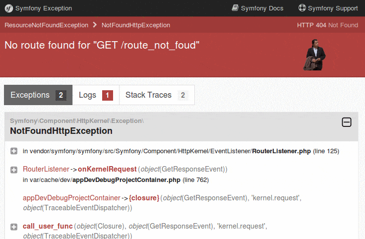

# GifExceptionBundle

[](https://packagist.org/packages/jolicode/gif-exception-bundle)
[](https://packagist.org/packages/jolicode/gif-exception-bundle)

The GhostBuster of your exception page!

It displays a GIF instead of Symfony's ghost on exception page and it's compatible with Symfony versions from 5.4 to latest.
Here is what it looks like :



*Be aware that we can not be held responsible for any loss of productivity during development.*

> **Note**
> Support for previous Symfony versions was available in previous versions of this bundle.
> See the [CHANGELOG](CHANGELOG.md) for more details.

## Installation

- Use [Composer](http://getcomposer.org/) with [Symfony Flex](https://github.com/symfony/flex) to install `GifExceptionBundle` in your project:

```shell
composer require jolicode/gif-exception-bundle --dev
```

Now enjoy your exceptions \o/

## Add some more gifs!

We need you to improve the included GIFs! Do not hesitate to open PRs to add
more gifs in [Resources/public/images/](Resources/public/images/), it will be very welcomed! :wink:

## Optimizing gifs

If you are adding gifs we strongly recommend optimizing them. There is a tool to aid with this (you will need to install [gifsicle](http://www.lcdf.org/gifsicle/)).

```
bin/optimizer.php
```

You can also run this command directly from your Symfony application:

```
bin/console gifexception:optimize
```

Although it would probably make more sense to use the former and push up the optimized gifs.

It uses [gifsicle](https://www.lcdf.org/gifsicle/) to optimize gifs via the [image-optimizer](https://github.com/psliwa/image-optimizer) library.

## Further documentation

You can see the current and past versions using one of the following:

* the `git tag` command
* the [releases page on Github](https://github.com/jolicode/GifExceptionBundle/releases)
* the file listing the [changes between versions](CHANGELOG.md)

And some meta documentation:

* [versioning and branching models](VERSIONING.md)
* [contribution instructions](CONTRIBUTING.md)

## Credits

* [All contributors](https://github.com/jolicode/GifExceptionBundle/graphs/contributors);
* All GIFs included belong to their respective authors.

## License

GifExceptionBundle is licensed under the MIT License - see the [LICENSE](LICENSE) file
for details.
